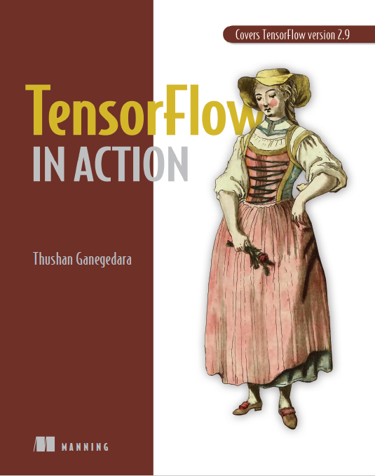

# TensorFlow in Action

This repository contains my personal chapter-by-chapter notes and experiments based on **_TensorFlow in Action_ by Thushan Ganegedara**. The book is a practical, end-to-end guide to TensorFlow 2: from core tensors and Keras APIs to advanced deep learning architectures and production deployment with TensorBoard and TFX. These notes are written in my own words to help me review concepts, remember key ideas, and quickly revisit important TensorFlow patterns without always reopening the book.

---

## Brief Contents

The original book is organized into three main parts covering foundations, real-world deep networks, and advanced/production topics.

**Part 1 – Foundations of TensorFlow 2 and Deep Learning**

- Chapter 1: The amazing world of TensorFlow  
- Chapter 2: TensorFlow 2  
- Chapter 3: Keras and data retrieval in TensorFlow 2  
- Chapter 4: Dipping toes in deep learning  
- Chapter 5: State-of-the-art in deep learning: Transformers

**Part 2 – “Look Ma, No Hands!” Deep Networks in the Real World**

- Chapter 6: Teaching machines to see – Image classification with CNNs  
- Chapter 7: Teaching machines to see better – Improving CNNs and making them confess  
- Chapter 8: Telling things apart – Image segmentation  
- Chapter 9: Natural language processing with TensorFlow – Sentiment analysis  
- Chapter 10: Natural language processing with TensorFlow – Language modeling

**Part 3 – Advanced Deep Networks for Complex Problems**

- Chapter 11: Sequence-to-sequence learning – Part 1  
- Chapter 12: Sequence-to-sequence learning – Part 2  
- Chapter 13: Transformers  
- Chapter 14: TensorBoard – Big brother of TensorFlow  
- Chapter 15: TFX – MLOps and deploying models with TensorFlow

---

## Core Topics Covered in the Book

The book walks through a wide range of TensorFlow 2 and deep learning topics, including:

- **TensorFlow 2 and Keras basics**  
  - Tensors, variables, operations, and eager execution  
  - Keras model-building APIs (Sequential, Functional, subclassing)  
  - Input pipelines with `tf.data`, Keras generators, and `tensorflow-datasets`

- **Deep learning architectures**  
  - Fully connected networks and autoencoders  
  - Convolutional neural networks for image classification and segmentation  
  - Recurrent neural networks and sequence models  
  - Transformer architectures and attention mechanisms

- **Real-world ML tasks**  
  - Image classification and Inception-style CNNs  
  - Image segmentation with DeepLab-style models  
  - Sentiment analysis and language modeling in NLP  
  - Sequence-to-sequence translation and Transformer-based applications

- **Monitoring and production**  
  - TensorBoard for visualization, monitoring, and profiling  
  - Building ML pipelines with TFX  
  - Model evaluation, serving, and deployment via APIs and serving infrastructure

---

## What This Repo Contains

- Per-chapter Markdown summaries (starting with Part 1, Chapters 1–5), written as study notes rather than full reproductions of the book.  
- Pointers to important figures (by label, e.g) that I capture from my own copy of the book for personal reference.  
- Optionally, small code snippets or experiment notes inspired by the examples, adapted to my own TensorFlow 2 workflows.

This repository is **not** a replacement for the original book. It is a learning log that documents what I have understood from *TensorFlow in Action* and supports future projects using TensorFlow 2.
